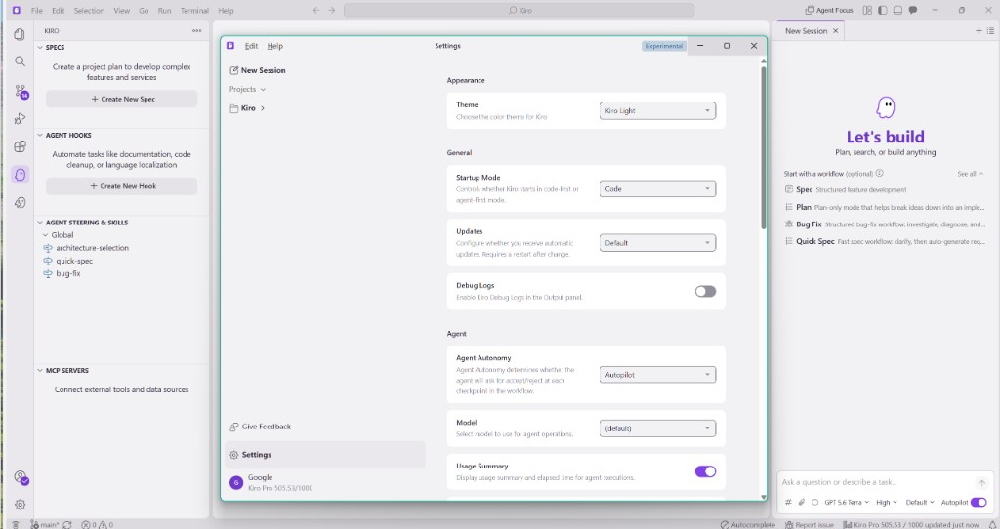
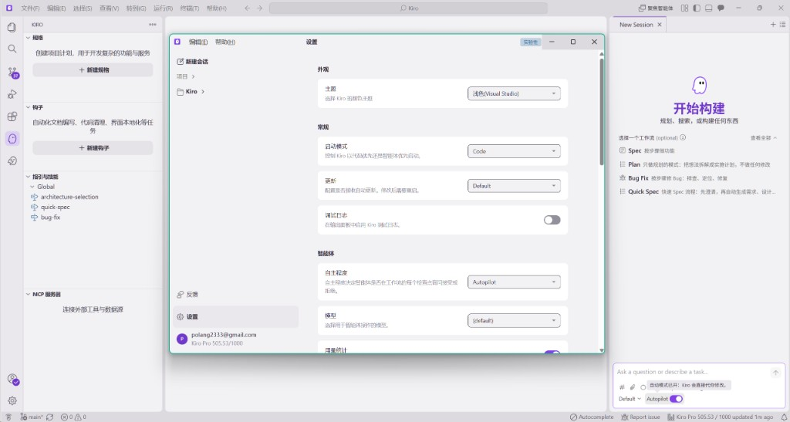

# Kiro Language Pack

[Kiro IDE](https://kiro.dev/) 社区语言包 — 编辑器主体 + Kiro 界面，支持**简体**与**繁体**中文。

[English](README.md) · **简体中文**


只发一个扩展；市场上的标题用英文（**Kiro Language Pack**）。装完后在命令面板里选显示语言即可。

## 效果

**安装前 · 英文**



**安装后 · 简体中文**



## 用法

1. 先卸载 Kiro 里其他语言包（本包**替代** VS Code 官方语言包，勿并存）。
2. 目前请从 [Releases](https://github.com/polang233/kiro-language-pack/releases) 安装 `.vsix`。
   Open VSX 上架进行中（预计页：[polang233/kiro-language-pack](https://open-vsx.org/extension/polang233/kiro-language-pack)），上线前请用 Release。
3. 命令面板 → **Language Pack: Select Display Language** → 选语言 → 重启。

Windows 不要双击 `.vsix`，用 **Extensions: Install from VSIX...**。

## 扩展 vs 可选补丁

| | 扩展（推荐） | 可选安装目录补丁 |
| --- | --- | --- |
| 做什么 | 正常装 `.vsix` | `npm run patch -- --apply` 改 Kiro 安装目录里 3 个文件 |
| 覆盖 | 编辑器主体 + Kiro 界面（会话列表、Settings、聚焦智能体、工具栏等） | 语言包够不到的约 89 条硬编码 |
| 是否受支持 | 是 | 否 — 升级会丢，`--restore` 还原 |
| 说明 | 切换语言不用重装 | `--apply` 若有 `dist/*.vsix` 会顺带安装（`--no-extension` 可跳过） |

详见 [docs/advanced-patch.zh-CN.md](docs/advanced-patch.zh-CN.md)。

## 局限

仍为英文（上游）：聊天面板、钩子编辑器、能力面板、账户/用量弹窗，以及部分写死的清单文案。

AI 回复语言与界面无关，可写 `.kiro/steering/language.md`。

实测 **Kiro 1.0.228**；其他版本大多可用。

## 多语言

| Locale | 本版 |
| --- | --- |
| `zh-cn` / `zh-tw` | 已含 |
| 其他 | `config.json` 已预置，补译文并 `enabled: true` 后进下一版 |

一个包内多语言；宿主按 `argv.json` 的 `locale` 加载对应译文。

## 文档与贡献

[docs/](docs/README.zh-CN.md) · [CONTRIBUTING.md](CONTRIBUTING.md) · [上架说明](docs/publishing.zh-CN.md)

```bash
npm install && npm run package
npm run check-upgrade   # Kiro 升级后
```

## 许可

MIT。编辑器主体译文来自 [microsoft/vscode-loc](https://github.com/microsoft/vscode-loc)。与 AWS / Microsoft 无隶属关系。
